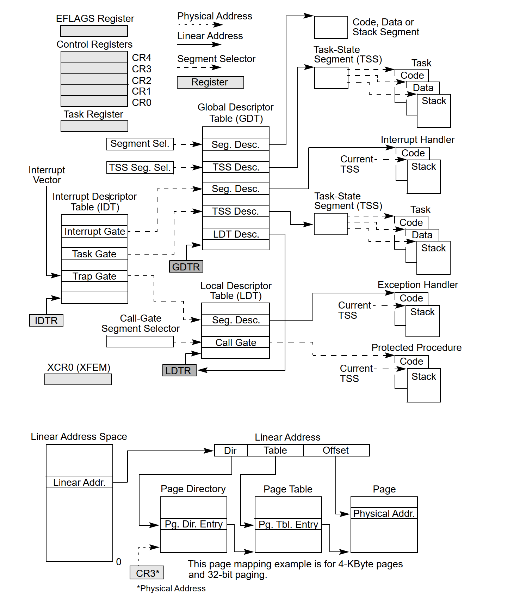
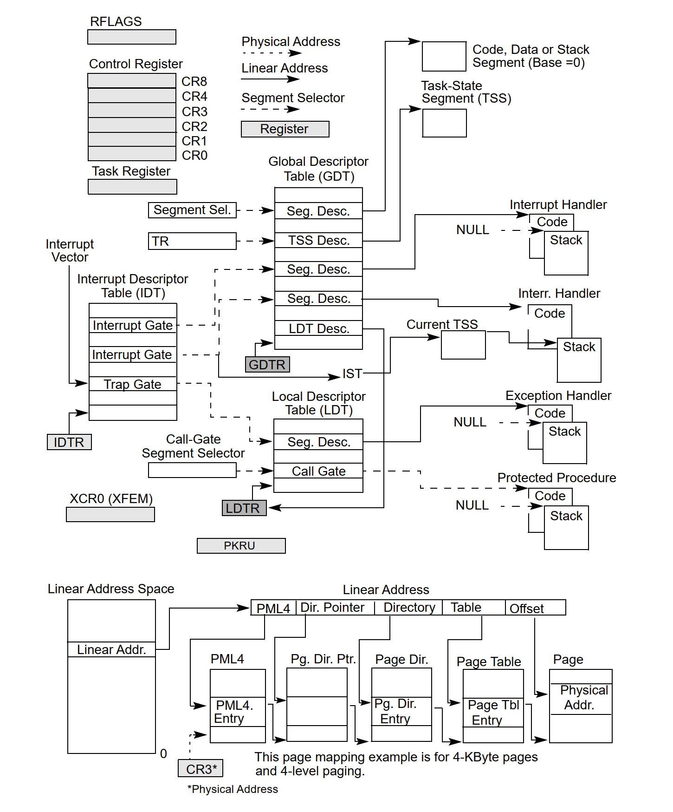

# 1 About This Manual

# 2 System Architecture Overview

IA-32 architecture (beginning with the Intel 386 processor family) provides support for operating-system and system-development software. This support offers multiple modes of operation, which include: 

- Read mode, protected mode, virtual 8086 mode, and system management mode.

Intel 64 architecture supports almost all the system programming facilities available in IA-32 architecture and extends them to a new operating mode (IA-32e mode) that supports a 64-bit programming environment. IA-32e mode allows software to operate in one of two sub-modes:

1. 64-bibit mode supports 64-bit OS and 64-bit applications
2. Compatibility mode alows most legacy software to run; it co-exists with 64-bit applications under a 64-bit OS

The IA-32 system-level architecture includes features to assist in the following operations:

1. Memory management
2. Protection of software modules
3. Multitasking
4. Exceptions and interrupt handling
5. Multiprocessing
6. Cache management
7. Hardware resource and power management
8. Debugging and performance monitoring

All Intel 64 and IA-32 processors enter read-address mode following a power-up or reset. Software then initiates the switch from read-address mode to protected mode. If IA-32e mode operation is desired, software also initiates a switch from protected mode to IA-32e mode.

## 2.1 Overview of the system-level architecture

System-level architecture consists of a set of registers, data structures, and instructions designed to support basic system-level operations such as memory management, interrupt and exception handling, task management, and control of multiple processors.

> IA32-System-level-Registers-and-Data-structure

> IA32e-System-level-Registers-and-Data-structure

### 2.1.1 Global and Local Descriptor Tables

When operating in **protected mode**, all memory accesses pass through either GDT or LDT. These tables contain entries called  segment descriptors. **Segment descriptors** provide the base address of segments well as rights, type, and usage infomation.

Each segment descriptor has an associated segment selector. A **segment selector** provides the software that uses it with an index into the GDT or LDT (the offset of its associated segment descriptor), a global/local flag (determines whether the selector points to the GDT or LDT), and access rights information.

To access a byte in a segment, a segment selector and an offset must be supplied. The **segment selector** provides access to the segment descriptor for the segment (in the GDT or LDT). From the segment descriptor, the processor obtains the base address of the segment in the linear address space. The **offset** then provides the location of the byte relative to the base address. This machanism can be used to access any valid code, data, or stack segment, provided the segment is accessible from the **current privilege level (CPL)** at which the processor is operating. The CPL is defined as the protection level of the currently executing code segment.

The linear address of the base of the GDT is contained in the GDT register (GDTR); the linear address of the LDT is contained in the LDT register (LDTR).

### 2.1.2 System Segments, Segment Descriptors, and Gates

Besides code, data, and stack segments that make up the execution environment of a program or procedure, the architecture defines two system segments: the **task-state segment (TSS)** and the **LDT**.

The architecture also defines a set of special descriptors called **gates** (call gates, interrupt gates, trap gates, and task gates). These provide protected **gateways** to system procedures and handlers that may operate at a different privilege level than application programs and most procedures. For example, a CALL to a call gate can provide access to a procedure in a code segment that is at the same or a numerically lower privilege level (more privileged) than the current code segment. To access a procedure through a call gate, the calling procedure supplies the **selector** for the call gate. The processor then performs an **access rights check** on the call gate, comparing the CPL with the privilege level of the call gate and the destination code segment pinted to by the call gate.

If access to the destination code segmeent is allowed, the processor gets the **segment selector** for the destination code segment and an **offset** into that code segment from the call gate. If the call requires a **change in privilege level**, the processor alse switches to the **stack** for the targeted privilege level.

### 2.1.3 Task-State Segment and Task Gates

The TSS defines the state of the execution environment for a task. It includes the state of **general-purpose registers**, **segment registers**, the **EFLAGS register**, the **EIP register**, and segment selectors with stack pointers for **three stack segments** (one stack for each privilege level). The TSS also includes the segment selector for the **LDT** associated with the task and the base address of the **paging-structure hierarchy**.

All program execution in protected mode happens within the **context of a task** (call the current task). The segment selector for the TSS for the current task is stored in the **task register**. The simplest method for switching to a task is to make a call or jump to the new task. Here, the segment selector for the TSS of the new task is given in the **CALL** or **JMP** instruction. In switching tasks, the processor performs the following actions:

1. Stores the state of the current task in the current TSS.
2. Loads the task register with the segment selector for the new task.
3. Access the new TSS through a segment descriptor in the GDT.
4. Loads the state of the new task from the new TSS into the general-purpose registers, the segment registers, the LDTR, control register CR3 (base address of the paging-structure hierarchy), the EFLAGS register, and the EIP register.
5. Begins execution of the new task.

A task can also be accessed through a **task gate**. A task gate is similar to a call gate, except that it provides access (through a segment selector) to a TSS rather than a code segment.

# 3 Protected-Mode Memory Management

# 4 Paging

